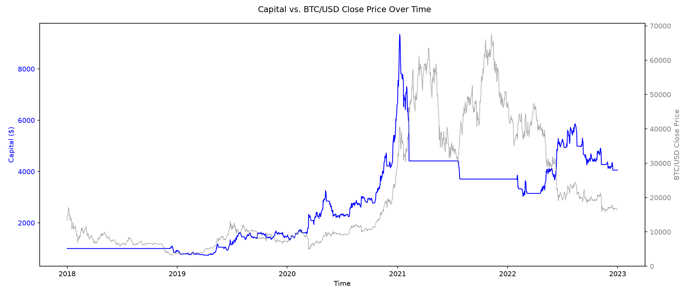
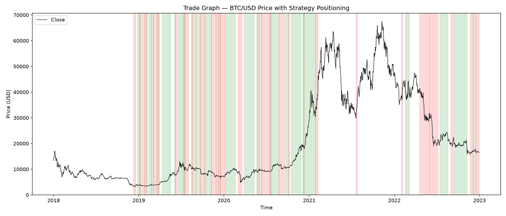

# BTC/USD Algorithmic Trading Strategy — ARIMA-GARCH + Technical Confirmation

A walk-forward backtested trading strategy for BTC/USD that combines a statistical
forecasting model (Box-Cox ARIMA for the conditional mean, GARCH(1,1) for the
conditional variance) with a technical indicator vote (SMA/EMA, MACD, RSI, Holt's
linear trend). Trades are only taken when both views agree, and a custom
event-driven backtesting engine handles execution, ATR-based trailing stops, and
performance reporting.

## Table of Contents

- [Overview](#overview)
- [Strategy Logic](#strategy-logic)
- [Results](#results)
- [Project Structure](#project-structure)
- [Installation](#installation)
- [Usage](#usage)
- [How It Works](#how-it-works)
- [Limitations](#limitations)
- [License](#license)

## Overview

This project backtests a daily BTC/USD trading strategy over 2018–2022 (1,826
candles). It was built to answer a specific question: can a statistical
mean/variance forecast (ARIMA + GARCH) be combined with classic technical
indicators to produce a signal that beats buy-and-hold, without any lookahead
bias?

Everything in the signal-generation pipeline is **walk-forward**: models are
re-fit every 5 trading days on an expanding window that only ever contains data
up to and including the current day, with a 250-day burn-in before any trade is
taken. A sampled re-run of the pipeline on truncated data (`main.py`) is used as
a spot-check to confirm no future information leaks into past signals.

## Strategy Logic

**Statistical view (ARIMA + GARCH):**
- Daily closes are Box-Cox transformed (lambda re-estimated at every refit,
  rather than assuming a fixed log transform).
- An ARIMA(0,1,0) model (random-walk-with-drift, chosen after comparing several
  orders on Sharpe ratio and drawdown, not AIC/BIC alone — see below) forecasts
  the next-day conditional mean.
- A GARCH(1,1) model forecasts the next-day conditional variance/volatility,
  since financial returns don't satisfy ARIMA's constant-variance assumption.
- A signal fires only if the forecasted move exceeds a volatility-scaled,
  fee-aware threshold (`THRESH_K * GARCH sigma`).

**Technical view (confirmation filter, not an independent trigger):**
- SMA(50/100/200) stacking/alignment
- EMA(15) vs. close
- MACD(12,26,9) crossover state
- RSI(14) relative to the 50 midline
- Holt's linear trend model forecast

Each casts a directional vote; the net vote becomes the technical view.

**Entry rule:** a trade is only taken when the statistical view and the
technical view agree on direction.

**Exit rule:** positions are protected by an ATR(14)-based trailing stop
(2x ATR), tracked through emitted signals in the strategy loop itself (see the
`strat()` docstring in `main.py` for why TP/SL columns aren't used for this).

### Why ARIMA(0,1,0)?

An AIC/BIC comparison across ARIMA orders was run, but AIC alone only measures
in-sample fit on a fixed window — it doesn't capture how estimation noise from
extra parameters propagates through a walk-forward refitting process with
volatility-scaled entry thresholds. Backtested performance was used instead:

| ARIMA Order | Sharpe Ratio | Net Profit | Max Drawdown | Notes |
|---|---|---|---|---|
| **(0,1,0)** | **0.93** | **$4,342** | **44.8%** | Best performing, selected |
| (1,1,1) | 0.85 | $3,716 | 60.4% | — |
| (2,1,2) | 0.63 – 0.80 | $1,562 – $2,629 | 62 – 75% | Initial run, unstable |
| (3,1,1) | N/A | N/A | N/A | Numerically unstable (Kalman filter) |

## Results

Backtested on BTC/USD daily data, 2018–2022 (1,826 candles), $1,000 starting
capital, compounding enabled, 0.15% transaction fee per trade.

| Metric | Value |
|---|---|
| Total Trades | 60 |
| Win Rate | 45% |
| Long / Short Trades | 31 / 29 |
| Net Profit (on $1,000) | $3,083.72 |
| Benchmark Return (Buy & Hold) | $236 |
| Sharpe Ratio | 0.84 |
| Maximum Drawdown | 60.65% |
| Average Win / Average Loss | $398 / $232 |
| Average Holding Time | 14 days |

**Capital vs. BTC/USD close price:**



**Trade positioning over the BTC/USD price series** (green = long, red = short):



## Project Structure

```
.
├── main.py            # Indicator/feature engineering, walk-forward ARIMA-GARCH
│                       #   + technical strategy, lookahead-bias check, graphing
├── backtester.py       # Event-driven backtesting engine (positions, trades,
│                       #   TP/SL, statistics, capital curve)
├── impdata.csv         # Raw OHLC input data (not included — bring your own)
├── final_data.csv      # Generated: processed data + signals (backtester input)
├── trade_graph.png     # Generated: price with long/short shading
├── pnl_graph.png        # Generated: capital vs. close price over time
└── README.md
```

## Installation

```bash
git clone <your-repo-url>
cd <your-repo>
pip install -r requirements.txt
```

**Dependencies:**

```
numpy
pandas
scipy
statsmodels
arch
matplotlib
plotly
```

## Usage

1. Place daily OHLC data for BTC/USD as `impdata.csv` in the project root, with
   at minimum `datetime, open, high, low, close` columns.
2. Run the pipeline:

```bash
python main.py
```

This will:
- Compute technical indicators and generate walk-forward strategy signals
- Save signals to `final_data.csv`
- Run the backtest and print performance statistics
- Run a sampled lookahead-bias check
- Save `trade_graph.png` and `pnl_graph.png`

You can also run the backtester directly against an existing signals file:

```bash
python backtester.py
```

## How It Works

`main.py` computes indicators (`process_data`), then walks forward day-by-day in
`strat()`: for each day past the burn-in period, it refits (every 5 days) or
carries forward the ARIMA-GARCH forecaster and Holt forecaster, derives a
statistical view and a technical view, and emits a signal only when both agree.
Position transitions (open, hold, reverse, close-on-stop) are handled explicitly
per the current position state.

`backtester.py` consumes the resulting signals CSV and simulates execution:
opening/closing/reversing positions, applying transaction fees, tracking
take-profit/stop-loss triggers against intrabar highs/lows, and computing
performance statistics (win rate, Sharpe ratio, drawdown, holding time, etc.)
and the capital curve.

## Limitations

- Daily BTC returns behave close to a random walk, so most of the strategy's
  edge comes from the GARCH volatility filter rather than the ARIMA mean
  forecast.
- Most of the profit was generated in 2019–2020; the strategy lost money in
  2021–2022. The reported Sharpe ratio may not generalize to other periods or
  regimes.
- Maximum drawdown (60.65%) is high relative to net profit — position sizing
  and risk management are areas for future improvement.

## License

MIT (or specify your preferred license).
